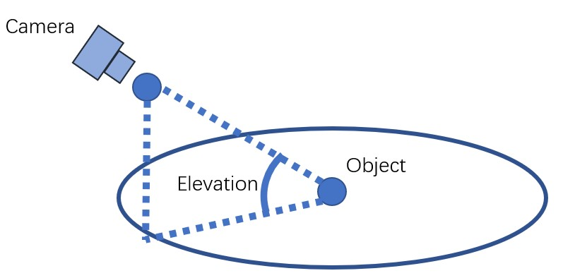
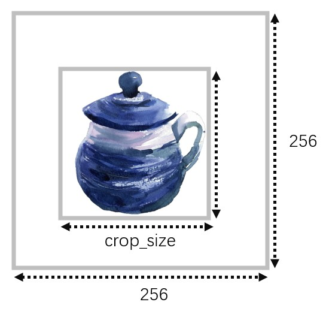

# SyncDreamer
SyncDreamer: Generating Multiview-consistent Images from a Single-view Image


## [Project page](https://liuyuan-pal.github.io/SyncDreamer/) | [Paper](https://arxiv.org/abs/2309.03453)

- [x] Inference codes and pretrained models.
- [ ] Training codes.

### Preparation for inference
1. Install packages in `requirements.txt`. We test our model on a 40G A100 GPU with 11.1 CUDA and 1.10.2 pytorch.
2. Download checkpoints at [here](https://connecthkuhk-my.sharepoint.com/:f:/g/personal/yuanly_connect_hku_hk/EjYHbCBnV-VPjBqNHdNulIABq9sYAEpSz4NPLDI72a85vw?e=8jGGhg).

### Inference
1. Make sure you have the following models.
```bash
SyncDreamer
|-- ckpt
    |-- ViT-L-14.ckpt
    |-- syncdreamer-pretrain.ckpt
```
2. (Optional) Predict foreground mask as the alpha channel. I use [Paint3D](https://apps.microsoft.com/store/detail/paint-3d/9NBLGGH5FV99) to segment the foreground object interactively. 
We also provide a script `foreground_segment.py` using `carvekit` to predict foreground masks and you need to first crop the object region before feeding it to `foreground_segment.py`. We may double check the predicted masks are correct or not.
```bash
python foreground_segment.py --input <image-file-to-input> --output <image-file-in-png-format-to-output>
```
3. Run SyncDreamer to produce multiview-consistent images.
```bash
python generate.py --ckpt ckpt/syncdreamer-pretrain.ckpt \
                   --input testset/aircraft.png \
                   --output output/aircraft \
                   --sample_num 4 \
                   --cfg_scale 2.0 \
                   --elevation 30 \
                   --crop_size 200
```
Explanation: 
- `--ckpt` is the checkpoint we want to load
- `--input` is the input image in the RGBA form. The alpha value means the foreground object mask.
- `--output` is the output directory. Results would be saved to `output/aircraft/0.png` which contains 16 images of predefined viewpoints per `png` file. 
- `--sample_num` is the number of instances we will generate. `--sample_num 4` means we sample 4 instances from `output/aircraft/0.png` to `output/aircraft/3.png`.
- `--cfg_scale` is the *classifier-free-guidance*. `2.0` is OK for most cases. We may also try `1.5`.
- `--elevation` is the elevation angle of the input image in degree. As shown in the following figure,
- 
- We assume the object is locating at the origin and the input image is captured by a camera of the elevation. Note we don't need a very accurate elevation angle but a rough value in [-10,40] degree is OK, e.g. {0,10,20,30}.
- `--crop_size` affects how we resize the object on the input image. The input image will be resize to 256\*256 and the object region is resized to `crop_size` as follows. `crop_size=-1` means we do not resize the object but only directly resize the input image to 256*256. 
`crop_size=200` works in most cases. We may also try `180` or `150`.
- 
- **Suggestion**: We may try different `crop_size` and `elevation` to get a best result. SyncDreamer does not always produce good results but we may generate multiple times with different `--seed` and select the most reasonable one.
- [testset_parameters.sh](testset_parameters.sh) contains the command I used to generate results.
4. Run a NeuS or a NeRF for 3D reconstruction.
```bash
# train a neus
python train_renderer.py -i output/aircraft/0.png \
                         -n aircraft-neus \
                         -b configs/neus.yaml \
                         -l output/renderer 
# train a nerf
python train_renderer.py -i output/aircraft/0.png \
                         -n aircraft-nerf \
                         -b configs/nerf.yaml \
                         -l output/renderer
```
Explanation:
- `-i` contains the multiview images generated by SyncDreamer. Since SyncDreamer does not always produce good results, we may need to select a good generated image set (from `0.png` to `3.png`) for reconstruction.
- `-n` means the name. `-l` means the log dir. Results will be saved to `<log_dir>/<name>` i.e. `output/renderer/aircraft-neus` and `output/renderer/aircraft-nerf`.
- Before training, we will run `carvekit` to find the foreground mask in `_init_dataset()` in `renderer/renderer.py`. The resulted masked images locate at `output/renderer/aircraft-nerf/masked-*.png`. Sometimes, `carvekit` may produce incorrect masks.
- A rendering video will be saved at `output/renderer/aircraft-neus/rendering.mp4` or `output/renderer/aircraft-nerf/rendering.mp4`.
- We will only save a mesh for NeuS but not for NeRF, which is `output/renderer/aircraft-neus/mesh.ply`.

## Acknowledgement

We have intensively borrow codes from the following repositories. Many thanks to the authors for sharing their codes.

- [threestudio](https://github.com/threestudio-project/threestudio)
- [stable diffusion](https://github.com/CompVis/stable-diffusion)
- [zero123](https://github.com/cvlab-columbia/zero123)
- [COLMAP](https://colmap.github.io/)
- [NeuS](https://github.com/Totoro97/NeuS)
- [Magic123](https://github.com/guochengqian/Magic123)
- [RealFusion](https://github.com/lukemelas/realfusion)


## Citation
If you find this repository useful in your project, please cite the following work. :)
```
@article{liu2022gen6d,
  title={SyncDreamer: Learning to Generate Multiview-consistent Images from a Single-view Image},
  author={Liu, Yuan and Lin, Cheng and Zeng, Zijiao and Long, Xiaoxiao and Liu, Lingjie and Komura, Taku and Wang, Wenping},
  journal={arXiv preprint arXiv:2309.03453},
  year={2023}
}
```